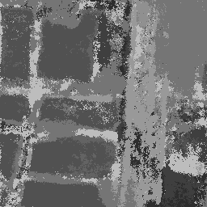
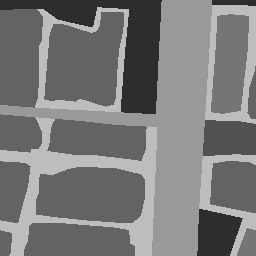
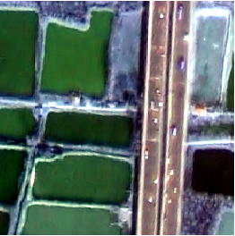
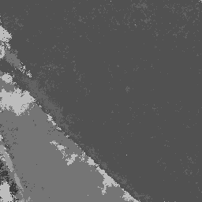
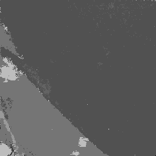
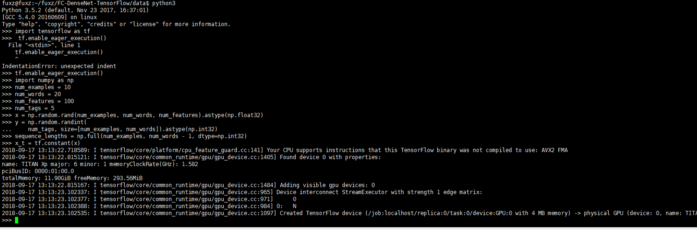
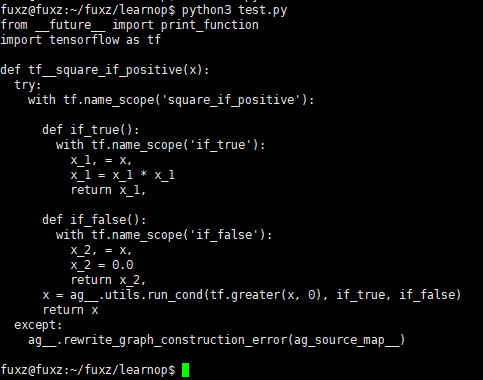

### 2018-09-10 ~ 2018-09-16

###  **实验1**

**实验意图与方向**：遥感图像语义分割

**实验来源**：使用论文[Tiramisu](https://arxiv.org/abs/1611.09326)的方法；

- 代码地址[github](https://github.com/HasnainRaz/FC-DenseNet-TensorFlow)

**实验基础**：

- 已有成果 \ 结果
	+ FCN OA(63%)

- 已有数据 \ 可下载到的数据
	+ 甲方给的
	+ ISPRS[数据说明下载地址](http://www2.isprs.org/commissions/comm2/wg4/vaihingen-2d-semantic-labeling-contest.html)

**实验结果**：
总体准确率为：62.07%
<figure class="third">
    
</figure>

###  **实验2**

**实验意图与方向**：在实验1的基础上增加crf

**实验来源**：使用论文[Tiramisu](https://arxiv.org/abs/1611.09326)的方法，使用crf改进；

- 代码地址[github](https://github.com/HasnainRaz/FC-DenseNet-TensorFlow)
- Tensorflow CRF[link](https://www.tensorflow.org/api_guides/python/contrib.crf)

**思路 \ 改进概述**：主要思路是因为看到这样的实验结果，以及deeplab的想法
<figure class="half">
    
</figure>

**实验基础**：

- 已有成果 \ 结果
	+ Tiramisu OA(62%)

- 已有数据 \ 可下载到的数据
	+ 甲方给的
	+ ISPRS[数据说明下载地址](http://www2.isprs.org/commissions/comm2/wg4/vaihingen-2d-semantic-labeling-contest.html)

**实验结果**：
总体准确率为：62.54%
<figure class="third">
    
</figure>

**实验总结**：因为在实验中仅仅使用了CRF，而非deeplab中提到的fully connected CRF,所以少了位置信息，效果有限。

 ### 其他
 - tf.enable_eager_execution()
 	+  eager execution能够使用Python 的debug工具、数据结构与控制流。并且无需使用placeholder、session，计算结果能够立即得出。它将tensor表现得像Numpy array一样，和numpy的函数兼容
	+ 运行效果如下：
 <figure class="1">
 	
 </figure>

- autograph
```python (type)
from __future__ import division, print_function, absolute_import
import tensorflow as tf
layers = tf.keras.layers
from tensorflow.contrib import autograph
import numpy as np
import matplotlib.pyplot as plt

tf.enable_eager_execution()

def square_if_positive(x):
	if x > 0:
		x = x * x
	else:
		x = 0.0
	return x


print(autograph.to_code(square_if_positive))

```
结果如下：
 <figure class="1">
 	
 </figure>
---

