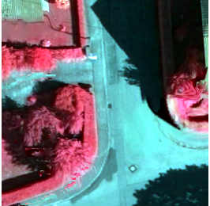
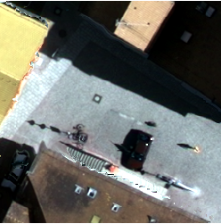
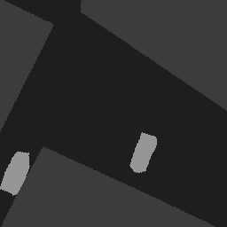
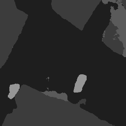

### 2018-09-17 ~ 2018-09-26

###  **回顾实验0**

**实验意图与方向**：在实验5的基础上增加网络层数

**实验结果**：总体准确率为：78.92%（结果OA=24.83%）

<figure class="third">
    
</figure>
---

### **实验1**
**实验意图与方向**：在实验0模型输出的结果中添加中值滤波

**实验结果**：
总体准确率为：79.4%

**实验总结**：实验效果并没有明显的提升

---

### **实验2**
**实验意图与方向**：在实验0的基础上，在网络的开始添加中值滤波

**实验结果**：总体准确率为：81.93%

**实验总结**：实验效果明显提升

---

### **实验3**
**实验意图与方向**：在实验2的基础上，在模型输出时添加中值滤波

**实验结果**：

总体准确率为：82.09%

**实验总结**：实验效果有所提升

<figure class="third">
    
</figure>

